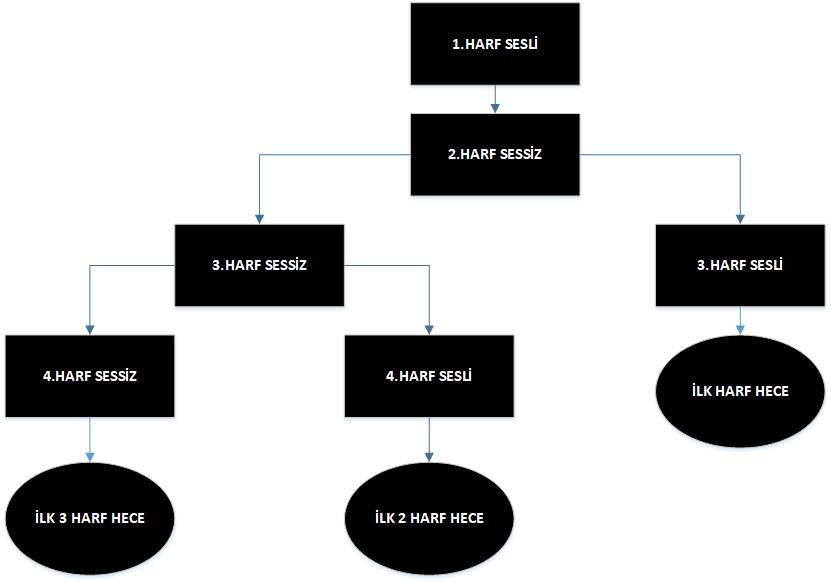
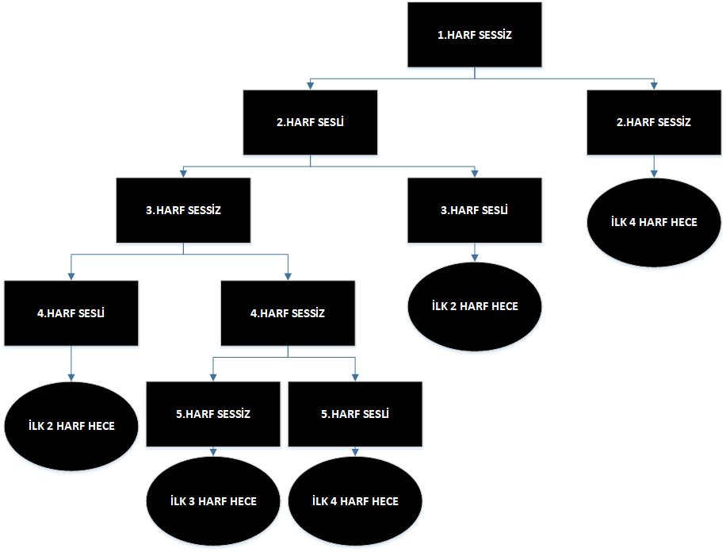

# Heceleme-Uygulamasi-spellingApp
 TDK hece yapısı kuralları baz alınarak yapılan bir projedir.
 Visual Studio programında C# dili ile yazılmıştır.
 Aşağıdaki kural sıralamasına göre kodlama yapılmıştır.

